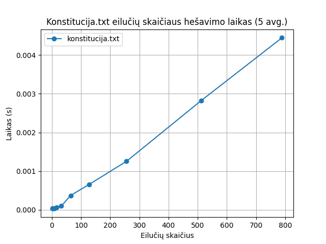

# AI patobulinta Hešavimo funkcija

## Rekvizitai

- C++ kompiliatorius, palaikantis C++17 standartą
- CMake

diagramos braižymui:
- Python
- uv

## Algoritmo idėja ir pseudokodas

### Idėja

Algoritmas pradeda nuo 64 baitų pradinio bloko (`kSeed`), kurį sluoksniais maišo su įvesties duomenimis. Įsiurbimo (absorption) fazė perkelia tekstą į bloką atlikdama XOR, rotacijas ir ritininio (`rolling`) akumuliatoriaus injekcijas. Kai įvesties daug, ši fazė vykdoma lygiagrečiai naudojant `std::transform_reduce`, `tbb::parallel_reduce` arba `std::async`, kad kiekvienas gautas dalinis blokas būtų sujungtas XOR operacija. Po įsiurbimo vykdomi trys nepriklausomi maišymo etapai (`mix_primary`, `mix_secondary`, `mix_final`), kuriuose sukami XOR, rotacijų ir skirtingų indeksavimo schemų deriniai. Galiausiai `collapse` sumažina 64 baitų būseną iki 32 baitų, dar kartą pritaikant rotacijas, XOR ir `PeriodicCounter`, o po to atliekami du papildomi maišymo etapai, kad būtų sukelta stipresnė lavina prieš rezultatą pavertžiant į heksų eilutę.

### Pseudokodas

```
konstantos:
  kSeed[64]        // pradinė būsena
  kXorKey[16]      // XOR raktas
  kByteScramble[64]// baitų permutacija
  kMixRotations[8] // rotacijų seka
  kParallelThreshold = 2048
  kBlockSize = 64
pagalbinės klasės:
    PeriodicCounter(n): atlieka skaičiavimą nuo 0 iki n, kur pasiekus n grįžta vėl iki 0.

funkcija hash256bit(tekstas):
  blokas ← kSeed

  jei tekstas != tuščias:
    jei tekstas.ilgis ≥ kParallelThreshold:
      absorb_parallel(tekstas, blokas)
    kitaip:
      absorb_sequential(tekstas, blokas)

  mix_primary(blokas)
  mix_secondary(blokas)
  mix_final(blokas)
  collapse(blokas, 32)
  mix_secondary(blokas)
  mix_final(blokas)

  grąžinti to_hex(blokas)
```

```
funkcija absorb_sequential(tekstas, blokas):
  counter ← PeriodicCounter(17)
  rolling ← 0xDEADBEEF
  kiekvienam simboliui index i tekste:
    byte ← tekstas[i]
    idx ← i mod kBlockSize
    partner ← (idx + 11) mod kBlockSize
    rolling ← rotl32(rolling + byte + kByteScramble[idx + byte], kMixRotations[idx])
    blokas[idx] ← blokas[idx] XOR byte
    blokas[partner] ← blokas[partner] XOR rotl8(byte + i, counter.value + i)
    cascade ← (idx * 3 + 23) mod kBlockSize
    blokas[cascade] ← blokas[cascade] XOR (rolling >> 5)
    counter.increment()
```

```
funkcija absorb_parallel(tekstas, blokas):
  rolling_values ← prefixiniai ritininiai sumai
  kontribucijos apskaičiuojamos lygiagrečiai:
    make_contribution(i):
      inicijuok tuščią BlockContribution
      atlik tuos pačius XOR ir rotacijas kaip absorb_sequential
      naudok rolling_values[i]
      grąžink dalinį bloką
  jei turime std::execution::par:
    total ← transform_reduce(par, make_contribution, XOR-merge)
  kitaip jei turime TBB:
    total ← parallel_reduce(make_contribution, XOR-merge)
  kitaip:
    padalink tekstą į worker_count gabalų
    paleisk std::async kiekvienam gabalui
    total ← XOR-merge visų gabalų rezultatų
  blokas XOR= total
```

```
funkcija mix_primary(blokas):
  rolling ← 0xC6A4A793
  counter ← PeriodicCounter(13)
  už i nuo 0 iki 63:
    scramble ← kByteScramble[blokas[i] + i]
    rolling ← rotl32(rolling XOR scramble * 0x45D9F3B, kMixRotations[i])
    partner ← (i * 7 + 11) mod 64
    combined ← blokas[i] XOR blokas[partner] XOR (rolling >> 18)
    blokas[i] ← rotl8(combined, counter.value + i) XOR scramble
    counter.increment()
  reverse ← 0x1B873593
  reverse_counter ← PeriodicCounter(11)
  iteruok nuo galo į pradžią:
    kiekvienam baitui pritaikyk papildomus XOR, rotl32 ir rotl8 su kByteScramble,
    naudok forward_partner ir reverse_counter, kad uždarytum apykaitinį maišymą
```

```
funkcija mix_secondary(blokas):
  jei tuščia → grįžti
  acc ← 0x9E3779B9 * blokas.ilgis
  kiekvienam indeksui i:
    acc ← rotl32(acc + kByteScramble[i*5] + blokas[i], kMixRotations[i])
    mirror ← paskutinis - i
    blokas[i] XOR= (acc & 0xFF)
    blokas[mirror] XOR= ((acc >> 8) & 0xFF)
```

```
funkcija mix_final(blokas):
  acc1 ← 0xA0761D65
  acc2 ← 0xE7037ED1
  counter ← PeriodicCounter(blokas.ilgis mod 11 + 7)

  pirmas etapas:
    kiekvienam i:
      pivot ← (i * 3 + blokas.ilgis - 1) mod blokas.ilgis
      acc1 ← rotl32(acc1 + blokas[i] + kByteScramble[acc2 + i], counter.value + i)
      acc2 ← rotl32(acc2 XOR (blokas[pivot] + i), counter.value + pivot)
      blokas[i] XOR= (acc1 & 0xFF)
      blokas[pivot] XOR= ((acc2 >> 8) & 0xFF)
      counter.increment()

  antras etapas:
    carry ← 0x6D
    kiekvienam i:
      neighbor ← (i + 1) mod blokas.ilgis
      mirror ← paskutinis - i
      mix ← blokas[neighbor] + blokas[mirror] + carry
      val ← rotl8(blokas[i] + mix, mix + i)
      carry ← val + i
      blokas[i] ← val XOR (carry >> 1)

  trečias etapas:
    tail ← 0x9B
    iteruok nuo galo:
      neighbor ← (i + blokas.ilgis - 1) mod blokas.ilgis
      tail ← rotl8(tail + blokas[neighbor] + i, tail + neighbor)
      blokas[i] XOR= tail

  ketvirtas etapas:
    lanes ← {0x510E527F, 0x9B05688C, 0x1F83D9AB, 0x5BE0CD19}
    kiekvienam i:
      lane ← i mod 4
      lanes[lane] ← rotl32(lanes[lane] + blokas[i] * 0x9E3779B1 + i * 0x7F4A7C15,
                           blokas[i] + i + lane)
      neighbor ← blokas[(i + 1) mod blokas.ilgis]
      lanes[lane] XOR= rotl32(neighbor + lanes[lane+1], 7 + lane*3)
    ciklas dar kartą per bloką:
      mix ← lanes[lane] XOR rotl32(lanes[lane+1], 11 + lane)
      blokas[i] XOR= (mix >> ((i mod 4) * 8)) & 0xFF
```

```
funkcija collapse(blokas, collapseSize):
  overflow ← blokas[collapseSize..]
  blokas ← pirmi collapseSize baitai
  rolling ← 0xB5297A4D
  counter ← PeriodicCounter(collapseSize mod 9 + 5)
  kiekvienam overflow elementui n:
    value ← overflow[n] XOR kByteScramble[overflow[n] + n]
    rolling ← rotl32(rolling + value * 0x7FEB352D + n, 11 + (n mod 8))
    kiekvienam i ∈ [0, collapseSize):
      result ← blokas[i] XOR value XOR kXorKey[(i + n) mod 16]
      result ← rotl8(result, counter.value + i + n)
      result XOR= (rolling >> ((i mod 4) * 8))
      blokas[i] ← result
      counter.increment()
    counter.reset()
```

```
funkcija rotl8(reikšmė, posūkis):
    posūkis ← posūkis mod 8
    jeigu posūkis == 0: grąžinti reikšmė
    grąžinti (reikšmė << posūkis) OR (reikšmė >> (8 - posūkis))
```


## Paleidimas

`# Unix/MacOS`
- `mkdir -p build/`
- `cmake ..`
- `cmake --build .`
- `./main [--input <input>  [--salt <salt>]]| --file <file_path>]`


`# Windows(netestuota, ymmw)`
- `dir build/`
- `cd build/`
- `cmake ..`
- `cmake --build .`
- `main.exe [--input <input> | --file <file_path>]`


`# Pavyzdys`
- `./main --input a`
- `./main --file ../konstitucija.txt`
- `./main --input a --salt asndiasdas`
## Testų sugeneravimas

Norint sugeneruoti testus, reikia paleisti šią komandą:

- `./main generate`

## Testavimas

Norint testuoti, reikia naudoti šią komandą (reikia turėti sugeneravus failus prieštai):
- `./benchmark`


Taip pat norint sugeneruoti dalinę užduoties dokumentaciją, galima naudoti:
- `./task`

atlikus testavimą, galima sugeneruoti konstitucijos nuotrauką su:
- `./draw_konstitucija`


## Užduotis

### 1. Įvedimas – bet kokio ilgio eilutė

Hešavimo funkcija priima betkokio ilgio įvestį

Hešavimo funkcija priima betkokio ilgio įvestį
| Įvestis | Hešas |
| ---------- | ---------- |
| a | 7f158916e9e17507e5ab2e975c5635f68a5cdaa0bcda8efc02e9a5f195fee117 |
| bbbb | 1d64903efd953477bcc211291b82a9db4bdd2ac4722a3ce303ebff538243807f |
| cccccccccccccccc | e4476c61810edd152297da64833e6b7599e52cdcbb506215e76568122ef6cd6c |
| dddddddddddddddddddddddddddddddddddddddddddddddddddddddddddddddd | 3e03d2758b90e40ed058ffe3eacab88a1de4c1990da537516653b9690f0dc5c8 |

### 2. Rezultatas – visada vienodo dydžio (256bit/64 hex simboliai).

Algoritmas duoda vienodo dydžio hešus - 64 hex simbolių.

| Įvestis | Hešo dydis | Hešas |
| ---------- | ---------- | ---------- |
| e | 64 | fa09be4fe889973884e8aeaae2b38cb91d367150936c0d7a3fb39adc196765f2 |
| ffff | 64 | a01a6dfe098574cf155a4e2d1e4bddf194717a332b434a20f635bd3b73b46da1 |
| gggggggggggggggg | 64 | b95636ffd8e59f79fcc6783a42a07933098183a644e93a8038a90c960aa48163 |
| hhhhhhhhhhhhhhhhhhhhhhhhhhhhhhhhhhhhhhhhhhhhhhhhhhhhhhhhhhhhhhhh | 64 | fe361bfae70040b070e4a1662a274cdd72f9bcff936cb0c642b4f2787ccbc18a |


### 3. Deterministiškumas – tas pats įvedimas = tas pats rezultatas.

Algoritmas deterministiškas – ta pati įvestis duoda tą patį rezultatą

| Įvestis | Hešas |
| ---------- | ---------- |
| lietuva | 1a183cb6831f090129720dbc8d92ef67352ea219c3275bf9152e7daf73e5d6b6 |
| lietuva (pakartotinai) | 1a183cb6831f090129720dbc8d92ef67352ea219c3275bf9152e7daf73e5d6b6 |
| Lietuva | a0f54249ec371d2e705b5d5d0385f568dcc7658521125cec56e942a1d1102226 |
| Lietuva (pakartotinai) | a0f54249ec371d2e705b5d5d0385f568dcc7658521125cec56e942a1d1102226 |
| Lietuva! | 7846582e95c228eed6d20d7e69353564f12e43768e46ef8b0d0b75a79990a8b9 |
| Lietuva! (pakartotinai) | 7846582e95c228eed6d20d7e69353564f12e43768e46ef8b0d0b75a79990a8b9 |
| Lietuva!! | aa8d7be46f0269f3bcb4887484520a1487050cf5bcb60cd959379f7dc3e0bec7 |
| Lietuva!! (pakartotinai) | aa8d7be46f0269f3bcb4887484520a1487050cf5bcb60cd959379f7dc3e0bec7 |

### 4. Efektyvumas – turi veikti pakankamai greitai.

Konstitucija.txt eilučių skaitymo laikai:

Konstitucija.txt eilučių skaitymo laikai:
| Eilučių kiekis | Laikas |
| ---------- | ---------- |
| 1 | 0.000033 |
| 2 | 0.000035 |
| 4 | 0.000038 |
| 8 | 0.000044 |
| 16 | 0.000066 |
| 32 | 0.000097 |
| 64 | 0.000372 |
| 128 | 0.000659 |
| 256 | 0.001255 |
| 512 | 0.002822 |
| 789 | 0.004442 |

Manau veikia pakankamai greitai.

### 5. Atsparumas kolizijoms – neturi būti lengva (praktiškai labai sudėtinga) rasti du skirtingus įvedimus, kurie duotų tą patį hash’ą.

| Lines | Symbols | Collisions | Frequency |
| ----: | ------: | ---------: | --------: |
| 100000 | 10 | 0 | 0.0000 |
| 100000 | 100 | 0 | 0.0000 |
| 100000 | 500 | 0 | 0.0000 |
| 100000 | 1000 | 0 | 0.0000 |

Kolizijų neaptikta.

### 6. Lavinos efektas (angl. Avalanche effect) – pakeitus vieną simbolį, rezultatas pasikeičia iš esmės.

| Įvestis | Hešas |
| ---------- | ---------- |
| lietuva | 1a183cb6831f090129720dbc8d92ef67352ea219c3275bf9152e7daf73e5d6b6 |
| Lietuva | a0f54249ec371d2e705b5d5d0385f568dcc7658521125cec56e942a1d1102226 |
| Lietuva! | 7846582e95c228eed6d20d7e69353564f12e43768e46ef8b0d0b75a79990a8b9 |
| Lietuva!! | aa8d7be46f0269f3bcb4887484520a1487050cf5bcb60cd959379f7dc3e0bec7 |

Lavinos efektas – yra.

Yra projekto testai (`HashTest.AvalancheSingleCharacter` ir
`HashTest.AvalancheBitFlipsAcrossMessage`) tikrina, kad 256-bit hešai
statistiškai skiriasi daugiau nei 100 bitų net ir pakeitus tik vieną simbolį.


### 7. Negrįžtamumas – iš hash’o praktiškai neįmanoma atspėti pradinio teksto.
 
Pažvelkime vėl į duomenis iš lavinos efekto.

| Įvestis | Hešas |
| ---------- | ---------- |
| lietuva | 1a183cb6831f090129720dbc8d92ef67352ea219c3275bf9152e7daf73e5d6b6 |
| Lietuva | a0f54249ec371d2e705b5d5d0385f568dcc7658521125cec56e942a1d1102226 |
| Lietuva! | 7846582e95c228eed6d20d7e69353564f12e43768e46ef8b0d0b75a79990a8b9 |
| Lietuva!! | aa8d7be46f0269f3bcb4887484520a1487050cf5bcb60cd959379f7dc3e0bec7 |

Manau saugiai galima pasakyti, kad įvestis neturi sąsąjų su hešavimo rezultatu.

## Eksperimentas

### Konstitucijos testas

Gauti rezultatai (vidurkis paimtas iš 5 testų):

| Eilučių kiekis | Laikas |
| ---------- | ---------- |
| 1 | 0.000033 |
| 2 | 0.000035 |
| 4 | 0.000038 |
| 8 | 0.000044 |
| 16 | 0.000066 |
| 32 | 0.000097 |
| 64 | 0.000372 |
| 128 | 0.000659 |
| 256 | 0.001255 |
| 512 | 0.002822 |
| 789 | 0.004442 |



Galima įžiūrėti, jog algoritmas yra tiesinis. Time complexity: O(n).
Manau veikia visai neblogu greičiu.

### Lavinos efektas


| Lines | Symbols | Avg Hex % | Avg Bit % | Min Hex % | Min Bit % | Max Hex % | Max Bit % |
| ----: | ------: | --------: | --------: | --------: | --------: | --------: | --------: |
| 100000 | 10 | 93.7429 | 49.9765 | 78.1250 | 36.7188 | 100.0000 | 63.6719 |
| 100000 | 100 | 93.7448 | 50.0191 | 78.1250 | 36.3281 | 100.0000 | 63.6719 |
| 100000 | 500 | 93.7502 | 49.9841 | 76.5625 | 36.3281 | 100.0000 | 63.6719 |
| 100000 | 1000 | 93.7547 | 50.0062 | 75.0000 | 35.9375 | 100.0000 | 62.8906 |

Duomenys rodo, jog funkcija gana gerai atlieka maišą – nepasitaikė nė vienos kolizijos

### Kolizijų paieška

Kolizijų testų rezultatai visai neblogi, kolizijų nepasitaikė.

| Lines | Symbols | Collisions | Frequency |
| ----: | ------: | ---------: | --------: |
| 100000 | 10 | 0 | 0.0000 |
| 100000 | 100 | 0 | 0.0000 |
| 100000 | 500 | 0 | 0.0000 |
| 100000 | 1000 | 0 | 0.0000 |
| 100000 | 10 | 0 | 0.0000 |

### Negrįžtamumo demonstracija

| Žodis[:Salt] | Hešas(Žodis+Salt) | 
| ---- | ---- | 
| Amerika | e37bceca9d5e66c6ccc93009d74726ff749508f4edd5c2434b8e9a1d3e3cc0c1 | 
| Amerika:Lietuva! | 2bd65cdeaff305fef486d0b723251b102745622badeed153131099a9775954e5 | 
| Jurgis | 11ee978089fb0f7b06fbc00d0fd2e5dcc85b073fd8f11bb44eff08c499014c42 |
| Jurgis:Šaltibarščiai | 11ee978089fb0f7b06fbc00d0fd2e5dcc85b073fd8f11bb44eff08c499014c42 |

Manau visai akivaizdu, jog salt naudojimas pakeičia rezultatą neatpažįstamai.

## Palyginimas

## Veikimo sparta

| Eilučių kiekis | AIHasher (s) | Hasher (s) |
| ---------- | ---------- | ---------- |
| 1 | 0.00002860000000000 | 0.00009080000000000 |
| 2 | 0.00003160000000000 | 0.00009460000000000 |
| 4 | 0.00003320000000000 | 0.00009460000000000 |
| 8 | 0.00004100000000000 | 0.00009880000000000 |
| 16 | 0.00005780000000000 | 0.00011940000000000 |
| 32 | 0.00008720000000000 | 0.00014680000000000 |
| 64 | 0.00034420000000000 | 0.00020720000000000 |
| 128 | 0.00058540000000000 | 0.00038080000000000 |
| 256 | 0.00116880000000000 | 0.00076000000000000 |
| 512 | 0.00250440000000000 | 0.00160920000000000 |
| 789 | 0.00382520000000000 | 0.00248440000000000 |

## Lavinos efektas

| Įvestis | AIHasher | Hasher |
| ---------- | ---------- | ---------- |
| lietuva | 1a183cb6831f090129720dbc8d92ef67352ea219c3275bf9152e7daf73e5d6b6 | 06ec0c64c58b069ac75e0f47394b99df12232f9eea03f00ab92c8f1778ade62c |
| Lietuva | a0f54249ec371d2e705b5d5d0385f568dcc7658521125cec56e942a1d1102226 | 06ec0c64c5aa7bf21138cbc92fd4b4df931701e4b436f59658b510de56e84edc |
| Lietuva! | 7846582e95c228eed6d20d7e69353564f12e43768e46ef8b0d0b75a79990a8b9 | 06ec0c64c5aa7bf21138cbc92fd4b4df931701e4b436f59658b510de56e84edc |
| Lietuva!! | aa8d7be46f0269f3bcb4887484520a1487050cf5bcb60cd959379f7dc3e0bec7 | 06ec0c64c5aa7bf21138cbc92fd4b4df931701e4b436f59658b5147f09ec8e9c |

| Lines | Symbols | Avg Hex % (Hasher) | Avg Hex % (AIHasher) | Avg Bit % (Hasher) | Avg Bit % (AIHasher) | Min Hex % (Hasher) | Min Hex % (AIHasher) | Min Bit % (Hasher) | Min Bit % (AIHasher) | Max Hex % (Hasher) | Max Hex % (AIHasher) | Max Bit % (Hasher) | Max Bit % (AIHasher) |
| ----: | ------: | -----------------: | -------------------: | -----------------: | -------------------: | -----------------: | -------------------: | -----------------: | -------------------: | -----------------: | -------------------: | -----------------: | -------------------: |
| 100000 | 10 | 28.1295 | 93.7429 | 14.7245 | 49.9765 | 0.0000 | 78.1250 | 0.0000 | 36.7188 | 85.9375 | 100.0000 | 49.6094 | 63.6719 |
| 100000 | 100 | 73.0929 | 93.7448 | 38.3615 | 50.0191 | 0.0000 | 78.1250 | 0.0000 | 36.3281 | 100.0000 | 100.0000 | 62.1094 | 63.6719 |
| 100000 | 500 | 63.4099 | 93.7502 | 33.2598 | 49.9841 | 0.0000 | 76.5625 | 0.0000 | 36.3281 | 100.0000 | 100.0000 | 61.3281 | 63.6719 |
| 100000 | 1000 | 62.8730 | 93.7547 | 33.0160 | 50.0062 | 0.0000 | 75.0000 | 0.0000 | 35.9375 | 100.0000 | 100.0000 | 62.5000 | 62.8906 |

## Kolizijų paieška
| Lines | Symbols | Collisions (Hasher) | Collisions (AIHasher) | Frequency (Hasher) | Frequency (AIHasher) |
| ----: | ------: | ------------------: | --------------------: | -----------------: | -------------------: |
| 100000 | 10 | 0 | 0 | 0.0000 | 0.0000 |
| 100000 | 100 | 0 | 0 | 0.0000 | 0.0000 |
| 100000 | 500 | 0 | 0 | 0.0000 | 0.0000 |
| 100000 | 1000 | 0 | 0 | 0.0000 | 0.0000 |

| Eilučių kiekis | AIHasher (s) | Hasher (s) |
| ---------- | ---------- | ---------- |
| 1 | 0.00002860000000000 | 0.00009080000000000 |
| 2 | 0.00003160000000000 | 0.00009460000000000 |
| 4 | 0.00003320000000000 | 0.00009460000000000 |
| 8 | 0.00004100000000000 | 0.00009880000000000 |
| 16 | 0.00005780000000000 | 0.00011940000000000 |
| 32 | 0.00008720000000000 | 0.00014680000000000 |
| 64 | 0.00034420000000000 | 0.00020720000000000 |
| 128 | 0.00058540000000000 | 0.00038080000000000 |
| 256 | 0.00116880000000000 | 0.00076000000000000 |
| 512 | 0.00250440000000000 | 0.00160920000000000 |
| 789 | 0.00382520000000000 | 0.00248440000000000 |

## Išvados

AI pagalba funkcija buvo patobulinta kardinaliai. Testavimo metu nebuvo užfiksuota nei vienos kolizijos, net keičiant po raidę iš 1000 raidžių įvesties. Veikia 60 procentų lėčiau nei mano kurtas algoritmas iš V1.3 versijos, tačiau užtikrina didesnį saugumą. Galimi patobulinimai: teisingai sukonfiguruoti paralelinius skaičiavimus, nes man atrodo neveikė testuojant. Taip pat galima būtų optimizuoti – nors užtrunka tik kelias šimtąsias sekundės, atliekant 100'000 ar 1'000'000> skaičiavimų šis laikas labai pasijaučia, jog reikia laukti.