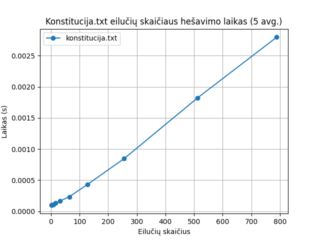

# Hešavimo funkcija

## Rekvizitai

- C++ kompiliatorius, palaikantis C++17 standartą
- CMake

diagramos braižymui:
- Python
- uv

## Algoritmo idėja ir pseudokodas

### Idėja

Šis algoritmas iš ties neturi gilios filosofijos už savęs. Mano tikslas buvo kuo daugiau prigalvoti visokių atsitiktinių dalykų, operacijų ir apdorojimų ir tikėtis, jog veiks. 

### Pseudokodas

```
xor_key <- "ARCHAS MATUOLIS";

funkcija hash256bit(įvestis):
    blokas <- 64bitų konstanta: "XxFg1yY7HND109623hirD8K8ZjyR3vvzvNnfB2O8rNIaEC4VqJvZyM7--8TzCfu"

    // tai random tekstas kurį suspausdinėjau klaviatūra.

    Jei įvestis ne tuščia:
        kiekvieną simbolį dedu į bloką[i mod 64] per XOR.
        į kaimyną (i + 11 mod 64) taip pat įmaišau rotate8(simbolis + i, (i*13)&0xC5).

    i nuo 0 iki 62:
        blokas[i] ← blokas[i] XOR xor_key[i mod xor_key.ilgis]
        blokas[i + 1] ← (blokas[i + 1] << 4) OR ((blokas[i] + i) mod 256)

    suglaudinti_bloką(blokas, 32)

    grąžinti hex(string(blokas))
```
```
funkcija rotate8(reikšmė, posūkis):
    posūkis ← posūkis mod 8
    jeigu posūkis == 0: grąžinti reikšmė
    grąžinti (reikšmė << posūkis) OR (reikšmė >> (8 - posūkis))
```

```
pc <- init PeriodicCounter(5)
// skaičiuoklis nuo 0 iki nurodyto skaičiaus, kurį pasiekus vėl grįžta į 0.

funkcija suglaudinti_bloką(v, dydis):
    pc.reset()
    perteklius ← v[dydis..galas]
    v ← v[0..dydis-1]

    kol perteklius ne tuščias:
        cnt ← 0
        kiekvienam baitui v[j]:
            val ← (pc.getCount() + perteklius.front()) mod 256
            pc.Increment()

            pasirinkimas ← val mod 6
            jei pasirinkimas == 0: v[j] ← v[j] + val
            jei == 1: v[j] ← v[j] - val
            jei == 2: v[j] ← v[j] * val
            jei == 3: v[j] ← v[j] XOR val
            jei == 4: v[j] ← v[j] AND val
            jei == 5: v[j] ← v[j] OR val

            b ← xor_key[cnt mod xor_key.ilgis]
            cnt ← cnt + 1

            v[j] ← rotate8(v[j], b)
            v[j] ← v[j] XOR (val * 37 mod 256)
            v[j] ← v[j] XOR perteklius.front()
            perteklius.front() ← (perteklius.front() + v[j] + cnt) mod 256

        perteklius.remove_front()
```
## Paleidimas

`# Unix/MacOS`
- `mkdir -p build/`
- `cmake ..`
- `cmake --build .`
- `./main [--input <input>  [--salt <salt>]]| --file <file_path>]`


`# Windows(netestuota, ymmw)`
- `dir build/`
- `cd build/`
- `cmake ..`
- `cmake --build .`
- `main.exe [--input <input> | --file <file_path>]`


`# Pavyzdys`
- `./main --input a`
- `./main --file ../konstitucija.txt`
- `./main --input a --salt asndiasdas`
## Testų sugeneravimas

Norint sugeneruoti testus, reikia paleisti šią komandą:

- `./main generate`

## Testavimas

Norint testuoti, reikia naudoti šią komandą (reikia turėti sugeneravus failus prieštai):
- `./benchmark`

atlikus testavimą, galima sugeneruoti konstitucijos nuotrauką su:

- `./draw_konstitucija`


## Užduotis

### 1. Įvedimas – bet kokio ilgio eilutė

Hešavimo funkcija priima betkokio ilgio įvestį

| Įvestis | Hešas |
| ---------- | ---------- |
| a | 8d6f744eb09f89df811b44c7f346cd26822d86ac60cdfb65f776aa7b805e535b |
| bbbb | d270d8cf30649510d4d2a443b100c2cb1097f4080d16552046881a5a673e29be |
| cccccccccccccccc | 2f24dd3d7db2473bd95db95a716d5cf238e498456e0f9ddb679afb3efa1aef79 |
| dddddddddddddddddddddddddddddddddddddddddddddddddddddddddddddddd | 5ee5532e401ba41521d545c75c1cc791b09ba5ce2d1a8ce751ca901f803bdf4c |

### 2. Rezultatas – visada vienodo dydžio (256bit/64 hex simboliai).

Algoritmas duoda vienodo dydžio hešus - 64 hex simbolių.

| Įvestis | Hešo dydis | Hešas |
| ---------- | ---------- | ---------- |
| e | 64 | 8b2dc866f02e13cc1b691ad5c02a84a8725d3e492eaf6071b18d30c2c04a9eb0 |
| ffff | 64 | 4945787dcd4fed8c7e129de85c3c40ad253bb6b0bf1308254ed9f1a0b137d907 |
| gggggggggggggggg | 64 | a7d34063f2b120277e4f740b957c329ff33cfb8574b452922e7d261cb7da7987 |
| hhhhhhhhhhhhhhhhhhhhhhhhhhhhhhhhhhhhhhhhhhhhhhhhhhhhhhhhhhhhhhhh | 64 | dfd7afb66a88e8740ee38a92520d2ce2f4e4de9d26bb79ca719bdf67c02bbb51 |


### 3. Deterministiškumas – tas pats įvedimas = tas pats rezultatas.

Algoritmas deterministiškas – ta pati įvestis duoda tą patį rezultatą

| Įvestis | Hešas |
| ---------- | ---------- |
| lietuva | 06ec0c64c58b069ac75e0f47394b99df12232f9eea03f00ab92c8f1778ade62c |
| lietuva (pakartotinai) | 06ec0c64c58b069ac75e0f47394b99df12232f9eea03f00ab92c8f1778ade62c |
| Lietuva | 06ec0c64c5aa7bf21138cbc92fd4b4df931701e4b436f59658b510de56e84edc |
| Lietuva (pakartotinai) | 06ec0c64c5aa7bf21138cbc92fd4b4df931701e4b436f59658b510de56e84edc |
| Lietuva! | 06ec0c64c5aa7bf21138cbc92fd4b4df931701e4b436f59658b510de56e84edc |
| Lietuva! (pakartotinai) | 06ec0c64c5aa7bf21138cbc92fd4b4df931701e4b436f59658b510de56e84edc |
| Lietuva!! | 06ec0c64c5aa7bf21138cbc92fd4b4df931701e4b436f59658b5147f09ec8e9c |
| Lietuva!! (pakartotinai) | 06ec0c64c5aa7bf21138cbc92fd4b4df931701e4b436f59658b5147f09ec8e9c |

### 4. Efektyvumas – turi veikti pakankamai greitai.

Konstitucija.txt eilučių skaitymo laikai:

| Eilučių kiekis | Laikas |
| ---------- | ---------- |
| 1 | 0.000099 |
| 2 | 0.000100 |
| 4 | 0.000104 |
| 8 | 0.000114 |
| 16 | 0.000133 |
| 32 | 0.000167 |
| 64 | 0.000235 |
| 128 | 0.000434 |
| 256 | 0.000848 |
| 512 | 0.001821 |
| 789 | 0.002795 |

Manau veikia pakankamai greitai.

### 5. Atsparumas kolizijoms – neturi būti lengva (praktiškai labai sudėtinga) rasti du skirtingus įvedimus, kurie duotų tą patį hash’ą.

| Lines | Symbols | Collisions | Frequency |
| ----: | ------: | ---------: | --------: |
| 100000 | 10 | 0 | 0.0000 |
| 100000 | 100 | 0 | 0.0000 |
| 100000 | 500 | 0 | 0.0000 |
| 100000 | 1000 | 0 | 0.0000 |


### 6. Lavinos efektas (angl. Avalanche effect) – pakeitus vieną simbolį, rezultatas pasikeičia iš esmės.

| Įvestis | Hešas |
| ---------- | ---------- |
| lietuva | 06ec0c64c58b069ac75e0f47394b99df12232f9eea03f00ab92c8f1778ade62c |
| Lietuva | 06ec0c64c5aa7bf21138cbc92fd4b4df931701e4b436f59658b510de56e84edc |
| Lietuva! | 06ec0c64c5aa7bf21138cbc92fd4b4df931701e4b436f59658b510de56e84edc |
| Lietuva!! | 06ec0c64c5aa7bf21138cbc92fd4b4df931701e4b436f59658b5147f09ec8e9c |

Lavinos efektas – yra.


### 7. Negrįžtamumas – iš hash’o praktiškai neįmanoma atspėti pradinio teksto.
 
Pažvelkime vėl į duomenis iš lavinos efekto.

| Įvestis | Hešas |
| ---------- | ---------- |
| lietuva | 06ec0c64c58b069ac75e0f47394b99df12232f9eea03f00ab92c8f1778ade62c |
| Lietuva | 06ec0c64c5aa7bf21138cbc92fd4b4df931701e4b436f59658b510de56e84edc |
| Lietuva! | 06ec0c64c5aa7bf21138cbc92fd4b4df931701e4b436f59658b510de56e84edc |
| Lietuva!! | 06ec0c64c5aa7bf21138cbc92fd4b4df931701e4b436f59658b5147f09ec8e9c |

Manau saugiai galima pasakyti, kad įvestis neturi sąsąjų su hešavimo rezultatu.

## Eksperimentas

### Konstitucijos testas

Gauti rezultatai (vidurkis paimtas iš 5 testų):

| Eilučių kiekis | Laikas |
| ---------- | ---------- |
| 1 | 0.000099 |
| 2 | 0.000100 |
| 4 | 0.000104 |
| 8 | 0.000114 |
| 16 | 0.000133 |
| 32 | 0.000167 |
| 64 | 0.000235 |
| 128 | 0.000434 |
| 256 | 0.000848 |
| 512 | 0.001821 |
| 789 | 0.002795 |



Galima įžiūrėti, jog algoritmas yra tiesinis. Time complexity: O(n).
Manau veikia visai neblogu greičiu. Prieš SHA256 ne
### Avalanche

Šioje vietoje algoritmas veikia vidutiniškai


| Lines | Symbols | Avg Hex % | Avg Bit % | Min Hex % | Min Bit % | Max Hex % | Max Bit % |
| ----: | ------: | --------: | --------: | --------: | --------: | --------: | --------: |
| 100000 | 10 | 28.13 | 14.72 | 0 | 0 | 85.94 | 49.61 |
| 100000 | 100 | 73.09 | 38.36 | 0 | 0 | 100 | 62.11 |
| 100000 | 500 | 63.41 | 33.26 | 0 | 0 | 100 | 61.33 |
| 100000 | 1000 | 62.87 | 33.02 | 0 | 0 | 100 | 62.5 |

### Colision

Kolizijų testų rezultatai visai neblogi, kolizijų nepasitaikė.

| Lines | Symbols | Collisions | Frequency |
| ----: | ------: | ---------: | --------: |
| 100000 | 10 | 0 | 0.0000 |
| 100000 | 100 | 0 | 0.0000 |
| 100000 | 500 | 0 | 0.0000 |
| 100000 | 1000 | 0 | 0.0000 |
| 100000 | 10 | 0 | 0.0000 |

## Išvados

